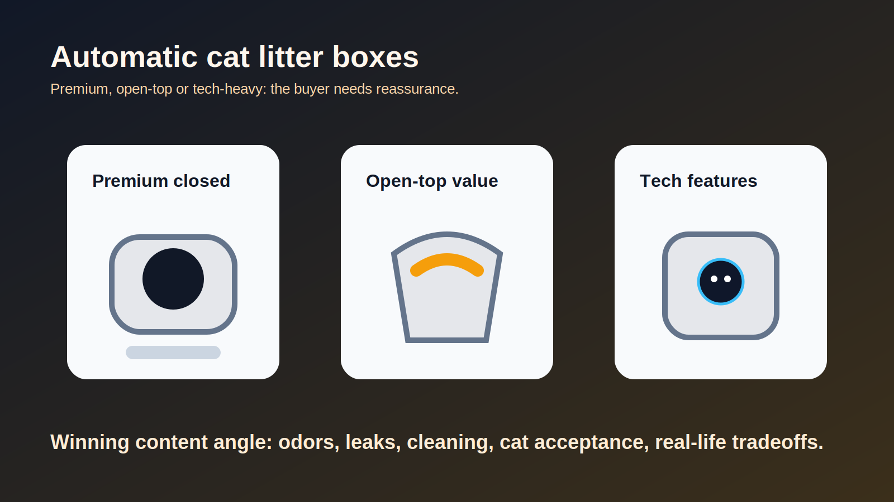

# Litieres automatiques pour chats : Litter-Robot vs Neakasa vs Petkit

Derniere mise a jour : 2026-06-05

## Resume strategique

Micro-niche prioritaire : les litieres automatiques sont des achats chers, anxiogenes et tres comparatifs. L'utilisateur cherche rarement une simple definition : il veut savoir quel modele evite les odeurs, les fuites, les pannes, le refus du chat et le nettoyage penible.

Verdict business : fort. Le panier moyen est eleve, le catalogue d'accessoires est profond, et Litter-Robot affiche un programme d'affiliation avec AOV 550+ USD, cookie 90 jours et 8% de commission selon sa page officielle.

## Pourquoi cette niche peut monetiser

- Achat premium, souvent entre plusieurs centaines et pres de 900 USD selon modele.
- Fort besoin de reassurance avant achat.
- Produits recurrents et accessoires : sacs, filtres, tapis, garanties, pieces.
- Comparatifs naturels : Litter-Robot vs Neakasa, Petkit vs Litter-Robot, meilleure litiere automatique pour grand chat.

## Signaux de demande

- Litter-Robot 5 est presente comme disponible aux Etats-Unis avec bundle vu a partir de 899 USD.
- Neakasa M1 / M1 Plus apparait autour de 399 a 455 USD selon variantes observees.
- Petkit Purobot Ultra est observe autour de 799.99 USD en prix officiel.
- Les discussions utilisateurs recentes citent des defauts concrets : fuites, nettoyage difficile, app, acceptation par le chat, taille interieure.

## Intention d'achat

Niveau : tres forte.

L'utilisateur a souvent deja un ou plusieurs chats et veut reduire une corvee quotidienne. Les requetes comparatives arrivent juste avant achat.

Requetes prioritaires :

- `meilleure litiere automatique chat`
- `Litter-Robot vs Neakasa`
- `Neakasa M1 avis`
- `Petkit Purobot Ultra avis`
- `litiere automatique grand chat`
- `litiere automatique plusieurs chats`

## Concurrence SEO estimee

Niveau : moyen.

Les pages existent, mais beaucoup sont soit trop promotionnelles, soit trop faibles sur les defauts reels. Une page honnete avec scenarios d'usage peut mieux convertir et inspirer confiance.

## Produits, services ou sous-categories a promouvoir

| Produit / offre | Role editorial | Lien affiliation |
| --- | --- | --- |
| Litter-Robot 5 | Choix premium / garantie / ecosysteme | `LIEN_AFFILIE_LITTER_ROBOT_5_A_AJOUTER` |
| Neakasa M1 / M1 Plus | Alternative open-top moins chere | `LIEN_AFFILIE_NEAKASA_M1_A_AJOUTER` |
| Petkit Purobot Ultra | Option tech avec camera / auto waste packing | `LIEN_AFFILIE_PETKIT_PUROBOT_A_AJOUTER` |
| Sacs et consommables | Revenus additionnels | `LIEN_AFFILIE_CONSOMMABLES_LITIERE_AUTO_A_AJOUTER` |
| Tapis anti-litiere / filtres | Cross-sell utile | `LIEN_AFFILIE_ACCESSOIRES_LITIERE_CHAT_A_AJOUTER` |

## Angles editoriaux prioritaires

1. `Meilleure litiere automatique pour chat : Litter-Robot, Neakasa ou Petkit ?`
2. `Litter-Robot vs Neakasa : premium ferme ou open-top moins cher ?`
3. `Quelle litiere automatique pour grand chat ou Maine Coon ?`
4. `Litiere automatique pour plusieurs chats : les criteres a verifier avant achat`
5. `Neakasa M1 avis : pour qui l'open-top est une vraie meilleure option ?`

## Structure d'article transactionnel recommandee

- H1 : `Meilleure litiere automatique pour chat : les modeles a comparer avant achat`
- Intro courte : achat cher, mauvais choix penible a retourner.
- Tableau verdict : premium, budget, grand chat, plusieurs chats, appartement.
- Section `Les 6 points qui font regretter un achat` : taille, odeurs, fuites, nettoyage, bruit, app.
- Comparatif detaille Litter-Robot 5 / Neakasa M1 / Petkit Purobot.
- Recommandations par profil.
- FAQ : acceptation par le chat, litiere compatible, odeurs, nettoyage, garanties.

## Risques et points de vigilance

- Ne pas cacher les retours negatifs sur fuites ou nettoyage : c'est justement ce qui rend le contenu credible.
- Verifier les pays de livraison; Litter-Robot 5 est indique comme disponible uniquement aux Etats-Unis sur la page consultee.
- Eviter les affirmations de securite absolue; decrire les dispositifs et rappeler de suivre les notices.
- Les prix varient souvent; dater les observations.

## Prochaine action recommandee

Produire un comparatif complet avec une grille par profil, puis un article secondaire `Litter-Robot vs Neakasa` pour capter les requetes de marque.

## Sources consultees

- https://www.litter-robot.com/affiliate.html
- https://www.litter-robot.com/litter-robot-5-whiskercare-bundle.html
- https://www.litter-robot.com/faq.html
- https://neakasa.com/products/neakasa-m1-cat-litter-box
- https://neakasa.com/products/m1-lite-self-cleaning-cat-litter-box
- https://www.petkit.com/products/purobot-ultra
- https://www.reddit.com/r/CatAdvice/comments/1q26vkr/2026_best_auto_litter_box/
