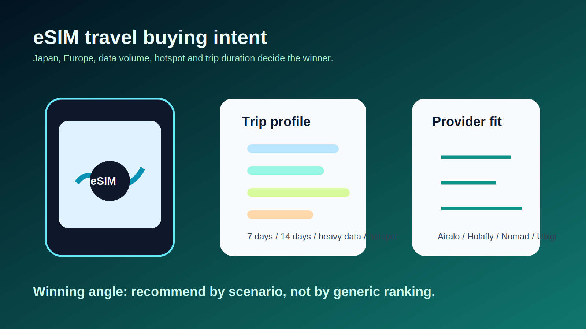

# Plan d'article transactionnel : eSIM Japon et Europe par profil de voyage

Derniere mise a jour : 2026-06-05

## Verdict business

Priorite : tres forte.

Les eSIM voyage combinent intention d'achat immediate, activation digitale rapide, programmes d'affiliation existants et forte demande saisonniere avant les departs. Le meilleur angle n'est pas `meilleure eSIM` de facon generale, mais `quelle eSIM choisir selon la duree, la destination, le volume data et le besoin hotspot`.

## Requete principale

`meilleure esim japon`

## Variantes commerciales

- `airalo vs holafly japon`
- `meilleure esim japon 14 jours`
- `esim japon illimitee`
- `esim japon hotspot autorise`
- `meilleure esim europe multi pays`
- `nomad vs airalo europe`
- `holafly vs airalo europe`

## Intention utilisateur reelle

L'utilisateur veut acheter avant depart et eviter :

- frais roaming operateur
- mauvaise couverture
- plan trop petit ou trop cher
- fair-use cache sur les offres illimitees
- absence de hotspot
- forfait data-only sans appels / SMS

## Offres a pousser

| Offre | Profil a cibler | Lien affiliation |
| --- | --- | --- |
| Airalo | Voyageur budget / forfaits ajustes / large couverture | `LIEN_AFFILIE_ESIM_AIRALO_A_AJOUTER` |
| Holafly | Gros utilisateur data qui veut une offre simple type illimitee | `LIEN_AFFILIE_ESIM_HOLAFLY_A_AJOUTER` |
| Nomad | Voyageur frequent / Europe / partage de donnees selon plans | `LIEN_AFFILIE_ESIM_NOMAD_A_AJOUTER` |
| Ubigi | Alternative a comparer pour Japon / couverture selon reseau | `LIEN_AFFILIE_ESIM_UBIGI_A_AJOUTER` |
| Saily / Maya Mobile / Mobimatter | Alternatives secondaires selon destination | `LIEN_AFFILIE_ESIM_ALTERNATIVE_A_AJOUTER` |

## Angle SEO principal

`Meilleure eSIM Japon : Airalo, Holafly, Nomad ou Ubigi selon votre voyage`

Pourquoi cet angle : Japon est une destination ou le besoin data est concret, les voyageurs comparent avant depart, et les differences entre forfaits limites, illimites, hotspot et couverture peuvent vraiment changer la recommandation.

## Structure recommandee

### H1

Meilleure eSIM Japon : quelle offre choisir selon votre voyage ?

### Intro

- Problematique : acheter avant depart pour eviter roaming et files d'attente.
- Preciser que les prix et forfaits changent vite; verifier au moment de l'achat.
- Promesse : verdict par profil, pas classement generique.

### Tableau verdict rapide

Colonnes : profil, offre a regarder d'abord, pourquoi, limites, lien.

Profils :

- 7 jours avec data moderee
- 14 jours avec Google Maps / reseaux sociaux
- gros utilisateur data
- besoin hotspot ordinateur
- voyage avec zones rurales
- voyageur budget strict

### Section 1 : Les criteres qui changent vraiment le choix

- Volume data
- Duree exacte
- Hotspot autorise ou non
- Reseaux locaux utilises
- Fair-use sur illimite
- Data-only vs appels / SMS
- Activation avant depart

### Section 2 : Comparatif des fournisseurs

Pour chaque fournisseur :

- meilleur cas d'usage
- points forts
- limites
- a verifier avant achat
- placeholder lien affilie

### Section 3 : Recommandations par scenario

- Si vous partez 7 jours
- Si vous partez 14 jours
- Si vous travaillez pendant le voyage
- Si vous allez hors grandes villes
- Si vous voulez le moins cher possible

### Section 4 : Alternatives Europe

Creer un encart `Vous partez aussi en Europe ?` puis pointer vers une future page Europe multi-pays.

### FAQ transactionnelle

- Une eSIM Japon fonctionne-t-elle avec tous les telephones ?
- Peut-on utiliser WhatsApp avec une eSIM data-only ?
- Faut-il activer l'eSIM avant ou apres l'arrivee ?
- Une offre illimitee est-elle vraiment illimitee ?
- Peut-on partager la connexion en hotspot ?

## Maillage interne recommande

- Page pilier : `meilleure esim voyage`
- Cluster Japon : forfait 7 jours, 14 jours, illimite, hotspot, Airalo vs Holafly.
- Cluster Europe : multi-pays, court sejour, long sejour, Nomad vs Airalo, Holafly vs Airalo.

## Risques et vigilance

- Ne pas inventer de prix; les verifier juste avant publication.
- Ne pas promettre une couverture parfaite.
- Mentionner que certaines offres sont data-only.
- Les offres illimitees peuvent avoir fair-use ou limitation hotspot selon fournisseur.

## Prochaine action recommandee

Rediger la page Japon en premier, puis creer une page Europe multi-pays avec le meme framework. Ajouter ensuite des pages comparatives de marque si les donnees de conversion confirment l'interet.

## Sources consultees

- https://www.airalo.com/m/resources/airalo-affiliate-program/
- https://www.airalo.com/help/afiliados-y-colaboraciones/JWVHG1H2NHJ7/does-airalo-have-an-affiliate-program/CVF0CNOFQN4I
- https://www.techradar.com/pro/best-esims-for-international-travel
- https://www.techradar.com/pro/best-esims-for-japan-in-year
- https://www.techradar.com/pro/best-esims-for-europe-in-year
- https://www.techradar.com/pro/nomad-review
