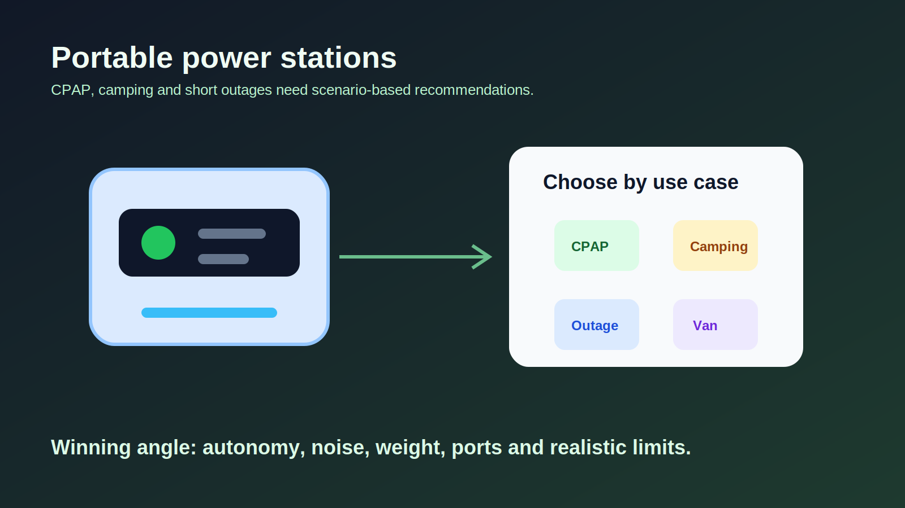

# Plan d'article transactionnel : stations d'energie portables CPAP, camping et coupures

Derniere mise a jour : 2026-06-05

## Verdict business

Priorite : moyen-fort.

La categorie a un bon panier moyen et un catalogue affilie profond, mais la concurrence sur `meilleure station energie portable` est forte. L'opportunite SEO exploitable est de descendre au niveau usage : CPAP silencieux, camping 1-2 nuits, coupures domestiques courtes, van / road trip.

## Requete principale recommandee

`meilleure station energie portable CPAP`

## Variantes commerciales

- `batterie portable CPAP camping`
- `station energie portable camping 2 jours`
- `EcoFlow vs Jackery vs Anker camping`
- `meilleure power station coupure courant`
- `station energie portable silencieuse nuit`

## Intention utilisateur reelle

L'utilisateur veut acheter un produit capable d'alimenter un appareil precis ou une situation concrete. Il a besoin de comprendre l'autonomie, le bruit, le poids, la puissance, les ports, la recharge solaire et les limites.

## Offres a pousser

| Offre | Profil a cibler | Lien affiliation |
| --- | --- | --- |
| Anker Solix C1000 | Usage general / bon rapport puissance-prix selon tests consultes | `LIEN_AFFILIE_ANKER_SOLIX_C1000_A_AJOUTER` |
| EcoFlow Delta 3 | Option officielle observee a 699 USD, ecosysteme EcoFlow | `LIEN_AFFILIE_ECOFLOW_DELTA_3_A_AJOUTER` |
| Jackery Explorer 2000 v2 | Besoin plus long / camping multi-jours | `LIEN_AFFILIE_JACKERY_2000_V2_A_AJOUTER` |
| Bluetti petites stations | Budget / format compact a verifier | `LIEN_AFFILIE_BLUETTI_STATION_A_AJOUTER` |
| Panneaux solaires compatibles | Cross-sell utile camping / backup | `LIEN_AFFILIE_PANNEAU_SOLAIRE_PORTABLE_A_AJOUTER` |

## Angle SEO principal

`Meilleure station energie portable pour CPAP : autonomie, bruit et choix par usage`

Pourquoi cet angle : CPAP cree une intention forte, mais il faut rester prudent et ne pas donner de conseil medical. L'article doit aider a choisir une batterie selon contraintes techniques, pas recommander un traitement.

## Structure recommandee

### H1

Meilleure station energie portable pour CPAP, camping et coupures courtes

### Intro

- Expliquer que le bon choix depend de l'appareil, de la duree et du bruit acceptable.
- Preciser que pour un usage CPAP, il faut verifier la consommation du modele et les consignes du fabricant.

### Tableau verdict rapide

Profils :

- CPAP une nuit
- CPAP avec humidificateur
- camping week-end
- coupure courte a la maison
- van / road trip
- budget compact

Colonnes : profil, capacite a viser, offre a regarder, limite, lien.

### Section 1 : Les criteres qui comptent vraiment

- Capacite Wh
- Puissance continue et pic
- Bruit du ventilateur
- Poids
- Recharge secteur / voiture / solaire
- UPS ou bascule rapide si besoin
- Nombre de ports AC / USB-C

### Section 2 : Les erreurs qui font regretter l'achat

- Prendre trop petit pour un appareil avec chauffage / humidificateur.
- Ignorer le bruit du ventilateur pour un usage nuit.
- Surestimer la recharge solaire.
- Acheter une station trop lourde pour du camping a pied.
- Confondre watts et watt-heures.

### Section 3 : Comparatif des modeles

Pour chaque modele :

- meilleur usage
- points forts
- limites
- a verifier avant achat
- lien placeholder

### Section 4 : Recommandations par scenario

- CPAP / nuit calme
- camping leger
- camping voiture
- coupure domestique
- van / frigo / ordinateur

### FAQ

- Combien de Wh faut-il pour un CPAP ?
- Une station d'energie peut-elle rester dans une chambre ?
- Faut-il une sortie AC ou DC ?
- Le solaire suffit-il en camping ?
- Peut-on alimenter un frigo ou une plaque de cuisson ?

## Risques et vigilance

- Ne pas faire de recommandation medicale personnalisee.
- Les autonomies dependent fortement de l'appareil branche.
- Les tests mentionnent parfois le bruit du ventilateur comme limite pour usage nocturne.
- Les prix fluctuent beaucoup; verifier avant publication.

## Prochaine action recommandee

Produire d'abord la page CPAP / nuit silencieuse, car elle reduit la concurrence generaliste. Ensuite, decliner en `camping 2 jours` et `coupure courant maison`.

## Sources consultees

- https://www.outdoorgearlab.com/topics/camping-and-hiking/best-power-station
- https://www.techradar.com/best/portable-power-stations
- https://us.ecoflow.com/products/delta-3-portable-power-station
- https://www.techradar.com/pro/aferiy-p280-portable-power-station-review
